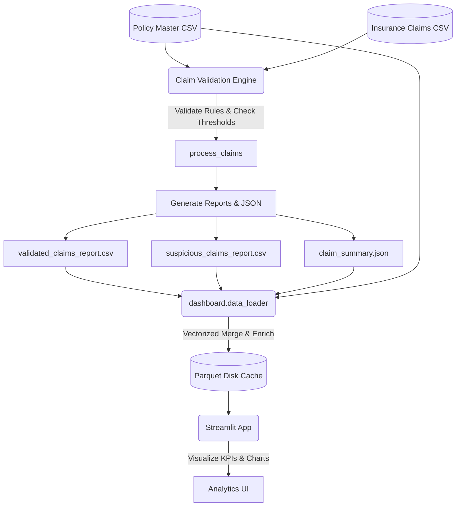

# 🛡️ Insurance Claims & Fraud Detection Hub

[](https://www.python.org/)
[](https://docs.pytest.org/)
[](https://pytest-cov.readthedocs.io/)
[](https://streamlit.io/)

An end-to-end, high-performance insurance claim validation and fraud detection system. The project consists of a core Python validation rules engine and an interactive Streamlit-based operations analytics portal.

---

## 🏗️ System Architecture

The project features a decoupled architecture separating the validation engine (batch processing) from the analytics visualization interface (interactive UI). Data is optimized using vectorized processing with Pandas and NumPy and cached both in-memory and on-disk in Parquet format.



---

## ⚡ Features

- **Decoupled Rules Engine**: Evaluates incoming claims against active policies, verifying validation limits, date formatting, and policy status.
- **Fraud/Suspicion Flagging**: Automatic classification of approved high-value claims (exceeding ₹200,000 threshold) with automated risk scoring (High/Medium/Low) based on amount and status.
- **Executive KPI Dashboard**: Interactive charts displaying approval rate, fraud rate, monthly trend, amount range distribution, and financial metrics.
- **Claims Search & Filter**: Instant lookup capabilities by Policy ID, Claim ID, or Customer ID.
- **Interactive Investigation Panel**: Detailed views of high-risk claims for fraud investigators, complete with investigation status and export utilities.
- **Optimized Performance**: Implements double-tier caching:
  - **In-memory**: Using Streamlit `@st.cache_data` with smart invalidation based on source file metadata.
  - **On-disk**: Using a fast Parquet storage cache (`.dashboard_cache/all_claims.parquet`) with automated file-modification checking.

---

## 📊 Core Rules & Engine Logic

Every claim processed by `claim_engine.py` is subjected to the following business rules:

| Rule Name | Target / Criteria | Action / Status | Rejection Reason |
| :--- | :--- | :--- | :--- |
| **Policy Existence** | Checks if policy exists in policy master list | `REJECTED` | `INVALID_POLICY` |
| **Active Policy** | Checks if policy status is `"ACTIVE"` | `REJECTED` | `EXPIRED_POLICY` |
| **Valid Date Format** | Date must be in `YYYY-MM-DD` format | `REJECTED` | `INVALID_DATE` |
| **Positive Amount** | Claim amount must be `> 0` | `REJECTED` | `NEGATIVE_AMOUNT` |
| **Coverage Limit** | Claim amount must not exceed policy coverage amount | `REJECTED` | `EXCEEDS_COVERAGE` |
| **High Value Suspicion** | Approved claim amount `> ₹200,000` | `APPROVED` (Flags as suspicious) | *None* |

---

## 📂 Project Structure

```text
├── dashboard/                  # Dashboard layout & styling components
│   ├── data_loader.py          # Data ingestion, caching, and vectorized aggregates
│   ├── sections.py             # Streamlit page layout renderers
│   ├── ui_components.py        # Styling, custom CSS injection, and chart rendering
│   └── __init__.py             # Package declaration
├── app.py                      # Streamlit dashboard entrypoint
├── claim_engine.py             # Claim processing validation engine
├── main.py                     # CLI entrypoint to execute batch engine
├── conftest.py                 # pytest configurations and sample fixtures
├── pytest.ini                  # pytest settings (coverage constraints)
├── requirements.txt            # Python dependencies list
├── test_claim_engine.py        # Complete unit testing suite for the engine
├── DASHBOARD.md                # In-depth dashboard documentation
└── README.md                   # Project documentation (this file)
```

---

## 💻 Installation & Getting Started

### 1. Prerequisites
Make sure you have **Python 3.8+** installed.

### 2. Clone and Setup Environment
Navigate to the directory and install dependencies:
```bash
pip install -r requirements.txt
```

### 3. Running the Batch Claim Engine
Run the engine via the CLI to validate claims and generate output reports:
```bash
python main.py
```
This processes `insurance_claims.csv` against `insurance_policy_master.csv` and outputs:
- `validated_claims_report.csv` - Valid approved claims.
- `suspicious_claims_report.csv` - Suspicious claims flagged for fraud analysis.
- `claim_summary.json` - Key aggregates and breakdown of rejection reasons.

### 4. Running the Streamlit Dashboard
Launch the interactive dashboard to visualize the operations and analytics:
```bash
streamlit run app.py
```
Open `http://localhost:8501` in your browser.

---

## 🧪 Testing & Code Coverage

The rules engine is backed by a robust test suite covering all validation permutations and target outcomes. 

### Running Tests
Execute the tests using `pytest`:
```bash
pytest
```

### Coverage Report
The test suite enforces **100% code coverage** for `claim_engine.py` as configured in `pytest.ini`. The generated reports are saved inside the `coverage_report/` directory:
- **Interactive HTML**: View `coverage_report/index.html` in your browser.
- **XML Report**: Available at `coverage_report/coverage.xml`.

---

## 🗃️ Data Schema

### 1. Policies (`insurance_policy_master.csv`)
- `policy_id` (str, primary key)
- `customer_id` (str)
- `policy_type` (str: `HEALTH`, `AUTO`, `HOME`, `LIFE`)
- `coverage_amount` (float)
- `policy_status` (str: `ACTIVE`, `EXPIRED`)

### 2. Claims Input (`insurance_claims.csv`)
- `claim_id` (str, primary key)
- `policy_id` (str, foreign key)
- `claim_amount` (float)
- `claim_date` (str: `YYYY-MM-DD`)
- `claim_type` (str: `MEDICAL`, `ACCIDENT`, `THEFT`, `FIRE`, etc.)

---

## 🤝 Contribution & License
This project is designed as part of the internal operations toolkit for claims validation and auditing. For major modifications, please ensure all unit tests pass with 100% coverage before committing.
